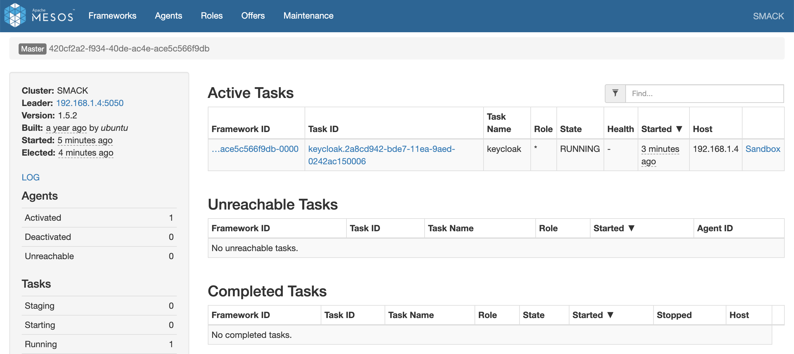
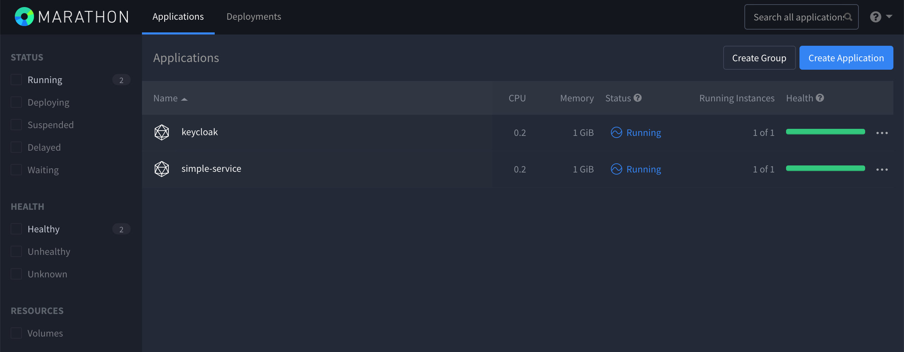

# springboot-mesos-marathon-keycloak-openldap

The goal of this project is to create a simple [`Spring Boot`](https://docs.spring.io/spring-boot/docs/current/reference/htmlsingle/) REST API, called `simple-service`, and secure it with [`Keycloak`](https://www.keycloak.org). The API users will be loaded from [`OpenLDAP`](https://www.openldap.org) server. Furthermore, we will start [`Mesos`](http://mesos.apache.org/) / [`Marathon`](https://mesosphere.github.io/marathon) environment, so that we can deploy `Keycloak` and `simple-service` in it.

## Application

- ### simple-service

  `Spring Boot` Java Web application that exposes two endpoints:
  - `/api/public`: endpoint that can be access by anyone, it is not secured;
  - `/api/private`: endpoint that can just be accessed by users that provides a `JWT` token issued by `Keycloak` and the token must contain the role `USER`.

## Prerequisites

- [`Java 11+`](https://www.oracle.com/java/technologies/downloads/#java11)
- [`Docker`](https://www.docker.com/)
- [`Docker-Compose`](https://docs.docker.com/compose/install/)

## Mac Users

A new directory called `/var/lib` must be added to Docker `File Sharing` resources. For it, follow the steps below
- Go to **Docker Desktop** and open `Preferences...` > `Resources` > `File Sharing`
- Add `/var/lib`
- Click `Apply & Restart` button

## Start Environment

- Open a terminal and make sure you are in `springboot-mesos-marathon-keycloak-openldap` root folder

- Export to an environment variable called `HOST_IP` the machine ip address
  ```
  export HOST_IP=$(ipconfig getifaddr en0)
  ```

- Run the following command
  ```
  docker-compose up -d
  ```

- Wait for Docker containers to be up and running. To check it, run
  ```
  docker-compose ps
  ```

## Service's URL

| Service  | URL                   |
|----------|-----------------------|
| Mesos    | http://localhost:5050 |
| Marathon | http://localhost:8090 |

## Import OpenLDAP Users

The `LDIF` file that we will use, `springboot-mesos-marathon-keycloak-openldap/ldap/ldap-mycompany-com.ldif`, contains already a pre-defined structure for `mycompany.com`. Basically, it has 2 groups (`developers` and `admin`) and 4 users (`Bill Gates`, `Steve Jobs`, `Mark Cuban` and `Ivan Franchin`). Besides, it's defined that `Bill Gates`, `Steve Jobs` and `Mark Cuban` belong to `developers` group and `Ivan Franchin` belongs to `admin` group.
```
Bill Gates > username: bgates, password: 123
Steve Jobs > username: sjobs, password: 123
Mark Cuban > username: mcuban, password: 123
Ivan Franchin > username: ifranchin, password: 123
```

To import those users to `OpenLDAP`

- In a terminal, make sure you are in `springboot-mesos-marathon-keycloak-openldap` root folder
- Run the following script
  ```
  ./import-openldap-users.sh
  ```

## Build simple-service Docker Image

- In a terminal, make sure you are in `springboot-mesos-marathon-keycloak-openldap` root folder

- Run the following script to build `simple-service` Docker Image
  ```
  ./docker-build.sh
  ```

## Deploy Keycloak to Marathon

- In a terminal and inside `springboot-mesos-marathon-keycloak-openldap` root folder, run
  ```
  curl -X POST \
    -H "Content-type: application/json" \
    -d @./marathon/keycloak.json \
    http://localhost:8090/v2/apps
  ```

- Open [`Marathon` website](http://localhost:8090) and wait for `Keycloak` to be healthy

- You can monitor `Keycloak` deployment logs on [`Mesos` website](http://localhost:5050)

  

  - On `Active Tasks` section, find the task `keycloak` and click on `Sandbox` (last link on the right)
  - Click on `stdout`
  - A window will open showing the logs at real-time

## Getting Keycloak host and port

When `Keycloak` is deployed to `Marathon`, it's assigned a host and port to it. There are two ways to obtain it

- Running the following command in a terminal 
  ```
  KEYCLOAK_HOST_PORT="$(curl -s http://localhost:8090/v2/apps/keycloak | jq -r '.app.tasks[0].host'):$(curl -s http://localhost:8090/v2/apps/keycloak | jq '.app.tasks[0].ports[0]')"
   
  echo $KEYCLOAK_HOST_PORT
  ```

- Using [`Marathon` website](http://localhost:8090)

## Configuring Keycloak

Keycloak can be configured by running a script or manually. For manual configuration check [`Configure Keycloak Manually`](https://github.com/ivangfr/springboot-mesos-marathon-keycloak-openldap/blob/master/configure-keycloak-manually.md). Below, it's explained to configure by running a script.

- In a terminal, make sure you are in `springboot-mesos-marathon-keycloak-openldap` root folder

- Get [`Keycloak` Host and Port](#getting-keycloak-host-and-port)
  
- Run the following script
  ```
  ./init-keycloak.sh $KEYCLOAK_HOST_PORT
  ```
  This script creates `company-services` realm, `simple-service` client, `USER` client role, `ldap` federation and the users `bgates` and `sjobs` with the role `USER` assigned.
  
## Deploy simple-service to Marathon

- Get [`Keycloak` Host and Port](#getting-keycloak-host-and-port)

- Update the property `env.keycloak.auth-server-url` that is present in `marathon/simple-service.json`, informing `Keycloak` address 

- In a terminal and inside `springboot-mesos-marathon-keycloak-openldap` root folder, run
  ```
  curl -X POST http://localhost:8090/v2/apps \
    -H "Content-type: application/json" \
    -d @./marathon/simple-service.json
  ```

- Open [`Marathon` website](http://localhost:8090) and wait for `simple-service` to be healthy. You can monitor `simple-service` deployment logs on [`Mesos` website](http://localhost:5050)

- The figure below shows `keycloak` and `simple-service` running on `Marathon`

  

## Getting simple-service host and port

When `simple-service` is deployed in `Marathon`, it's assigned to it a host and port. There are two ways to obtain it

- Running the following command in a terminal 
  ```
  SIMPLE_SERVICE_HOST_PORT="$(curl -s http://localhost:8090/v2/apps/simple-service | jq -r '.app.tasks[0].host'):$(curl -s http://localhost:8090/v2/apps/simple-service | jq '.app.tasks[0].ports[0]')"
   
  echo $SIMPLE_SERVICE_HOST_PORT
  ```
  
- Using [`Marathon`](http://localhost:8090)

## Testing simple-service

- In a terminal, make sure you have the environment variables [`KEYCLOAK_HOST_PORT`](#getting-keycloak-host-and-port) and [`SIMPLE_SERVICE_HOST_PORT`](#getting-simple-service-host-and-port) with the host and port of `Keycloak` and `simple-service` respectively

- Try to access `GET /api/public` endpoint
  ```
  curl -i "http://$SIMPLE_SERVICE_HOST_PORT/api/public"
  ```
  It should return
  ```
  HTTP/1.1 200
  It is public.
  ```

- Access `GET /api/private` endpoint (without authentication)
  ```
  curl -i "http://$SIMPLE_SERVICE_HOST_PORT/api/private"
  ```
  It should return
  ```
  HTTP/1.1 302
  ```
  > Here, the application is trying to redirect the request to an authentication link.

- Get `bgates` access token
  ```
  BGATES_ACCESS_TOKEN=$(curl -s -X POST \
    "http://$KEYCLOAK_HOST_PORT/realms/company-services/protocol/openid-connect/token" \
    -H "Content-Type: application/x-www-form-urlencoded" \
    -d "username=bgates" \
    -d "password=123" \
    -d "grant_type=password" \
    -d "client_id=simple-service" | jq -r .access_token)
  
  echo $BGATES_ACCESS_TOKEN
  ```

- Access `GET /api/private` endpoint this time, informing the access token
  ```
  curl -i -H "Authorization: Bearer $BGATES_ACCESS_TOKEN" "http://$SIMPLE_SERVICE_HOST_PORT/api/private"
  ```
  It should return
  ```
  HTTP/1.1 200
  bgates, it is private.
  ```

## Shutdown

- Go to `Marathon` and click `simple-service` application
- In the next page, click the `gear` symbol and then on `Destroy`
- Confirm the destruction of the application
- Do the same for `keycloak` application

- Go to a terminal and, inside `springboot-mesos-marathon-keycloak-openldap` root folder, run
  ```
  docker-compose down -v
  docker rm -v $(docker ps -a -f status=exited -f status=created -q)
  ```

## Cleanup

- To remove the Docker image created in this project, go to a terminal and, inside `springboot-mesos-marathon-keycloak-openldap` root folder, run the script below
  ```
  ./remove-docker-images.sh
  ```

- **Mac Users**
  
  Remove `/var/lib` added to Docker `File Sharing` resources
  - Go to **Docker Desktop** and open `Preferences...` > `Resources` > `File Sharing`
  - Remove `/var/lib` by clicking the `-` (minus) icon
  - Click `Apply & Restart` button
